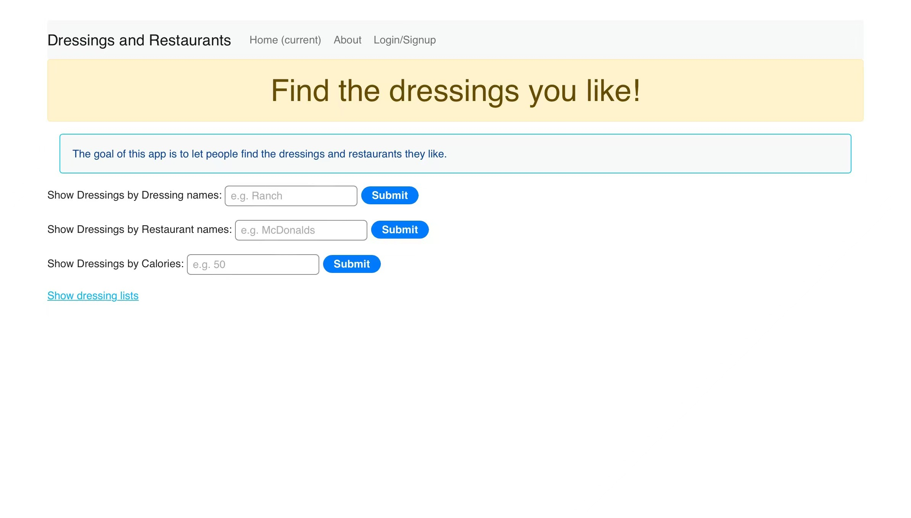
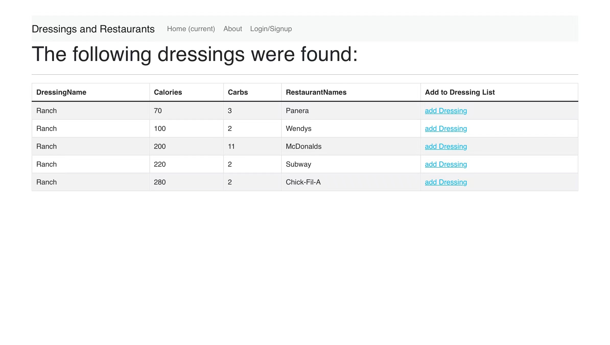
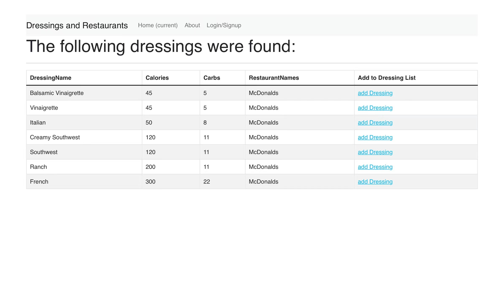
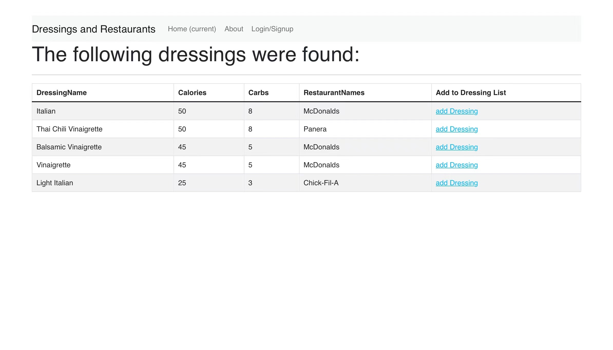
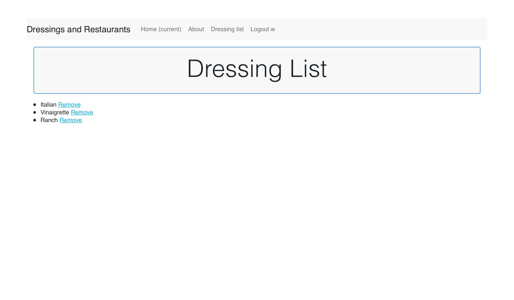

# cs103a-cpa02: Find dressings

This app is used to find dressings based on the database named dressings.json. The users can find dressings from the dressings names, restaurant names, and calories of the dressings. Users can also log in to create their own dressing lists.

Heroku link: https://aqueous-tor-83065.herokuapp.com/

## How to use

